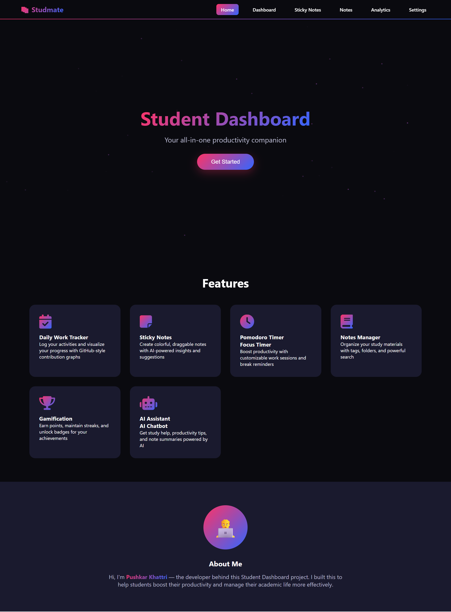
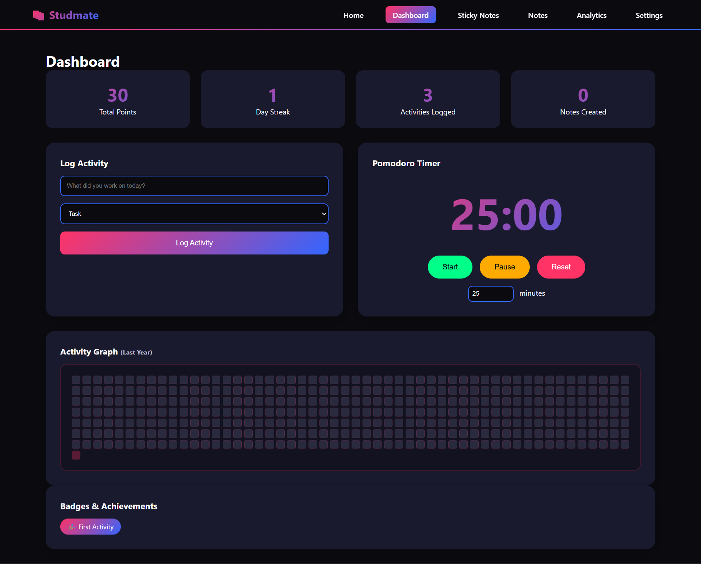
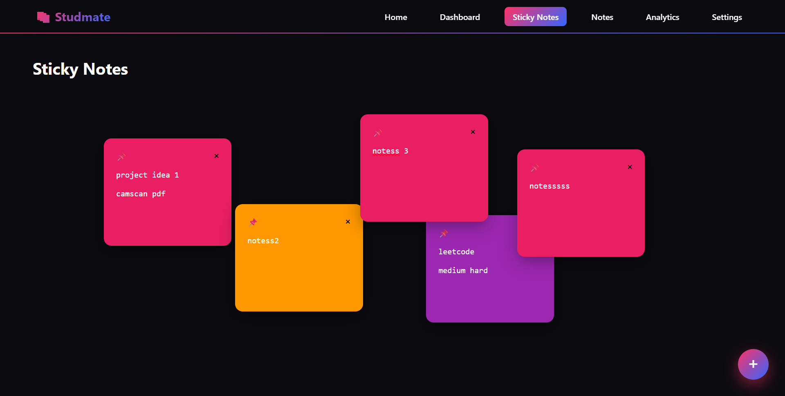
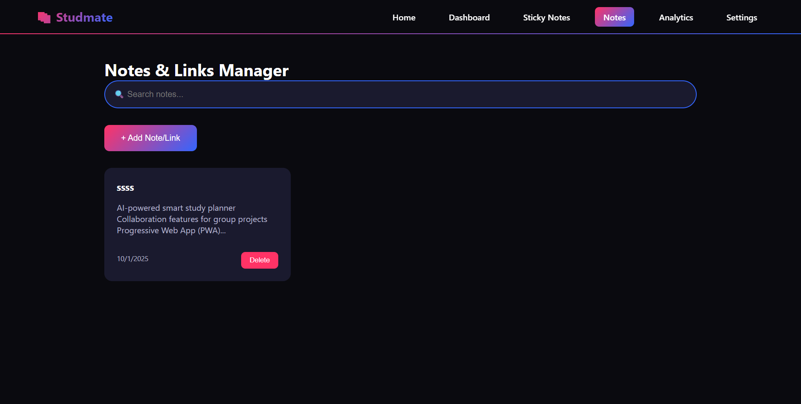
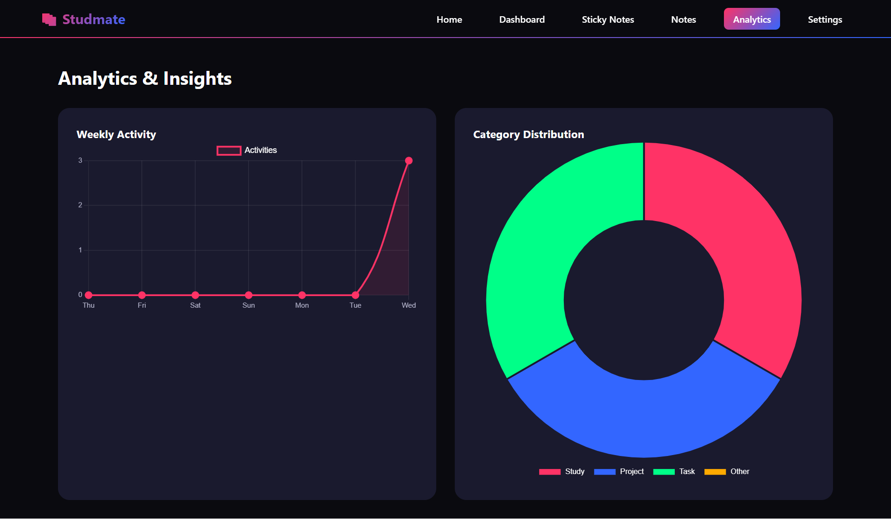
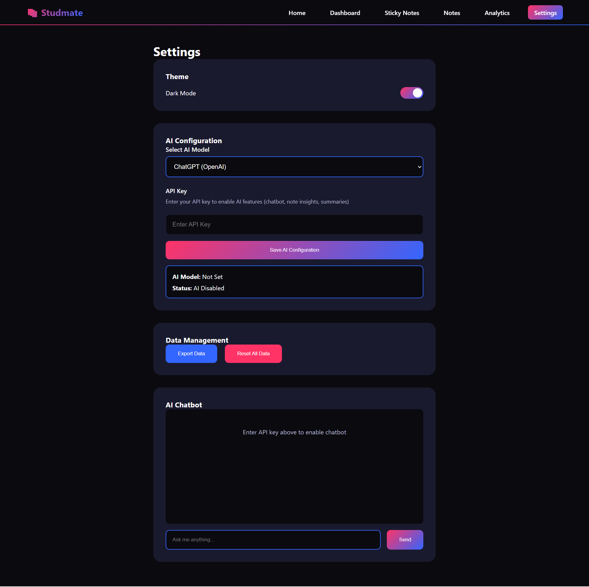

# 📚 Studmate – Student Productivity Dashboard

Studmate is a modern **all-in-one productivity companion** built with vanilla **HTML, CSS, and JavaScript**.  
It helps students **track progress, take notes, stay focused, and gamify learning** – all in one place.

---

## ✨ Features

- ✅ **Daily Work Tracker** – Log activities and view progress with GitHub-style contribution graphs  
- 📝 **Sticky Notes** – Create draggable, colorful notes to capture quick thoughts  
- ⏳ **Pomodoro / Focus Timer** – Stay productive with customizable work sessions  
- 📖 **Notes Manager** – Organize notes/links with tags, search, and categories  
- 📊 **Analytics Dashboard** – Weekly activity trends & category distribution charts  
- 🏆 **Gamification** – Earn points, streaks, and unlock achievement badges  
- 🤖 **AI Assistant** – Connect your API key (ChatGPT, Claude, Gemini, Groq) to get study help & summaries  
- 🎨 **Dark/Light Theme** – Toggle seamlessly between themes  

---
## 📂 Project Structure
```graphql
studmate/
│── index.html      # Main HTML file (UI pages: home, dashboard, notes, settings, etc.)
│── style.css       # Styling with dark/light theme support
│── app.js          # Core logic: activities, notes, analytics, AI integration
│── assets/         # (Optional) Place screenshots, icons, etc.
└── README.md       # Project documentation
```
---

## 🖥️ Demo Preview

### Home Page


### Dashboard


### Sticky Notes


### Notes


### Analytics


### Settings



---
## Demo

Live Preview :-https://ragas958.github.io/Studmate/

---
## 🚀 Getting Started

### 1. Clone Repository
```bash
git clone https://github.com/your-username/studmate.git
cd studmate
```
---
### 2. Run Locally
Simply open index.html in your browser.
OR use a local server:
```bash
# With Python
python3 -m http.server 8080

# With Node.js (live-server)
npx live-server
```
##### Then visit: http://localhost:8080
---
## ⚙️ Configuration
- ### AI Setup
     Go to Settings → AI Configuration, choose a model (ChatGPT, Claude, Gemini, Groq), and paste your API key.
      Features enabled: chatbot, note insights, summaries.

- ### Data Management
     Export/Reset all data anytime from Settings → Data Management.
---
## 🛠️ Built With
- HTML5, CSS3, JavaScript (Vanilla)

- GSAP:– animations & transitions

- Chart.js:– analytics & visualizations

- LocalStorage :– data persistence
---
## 🌟 Future Improvements
- Cloud sync for cross-device access
- AI-powered smart study planner
- Collaboration features for group projects
- Progressive Web App (PWA) support
---
